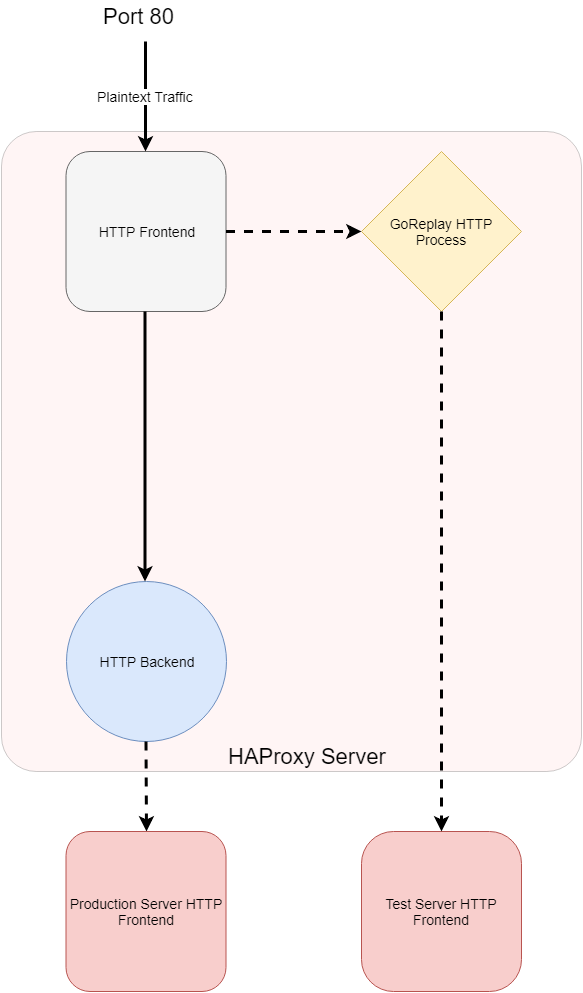
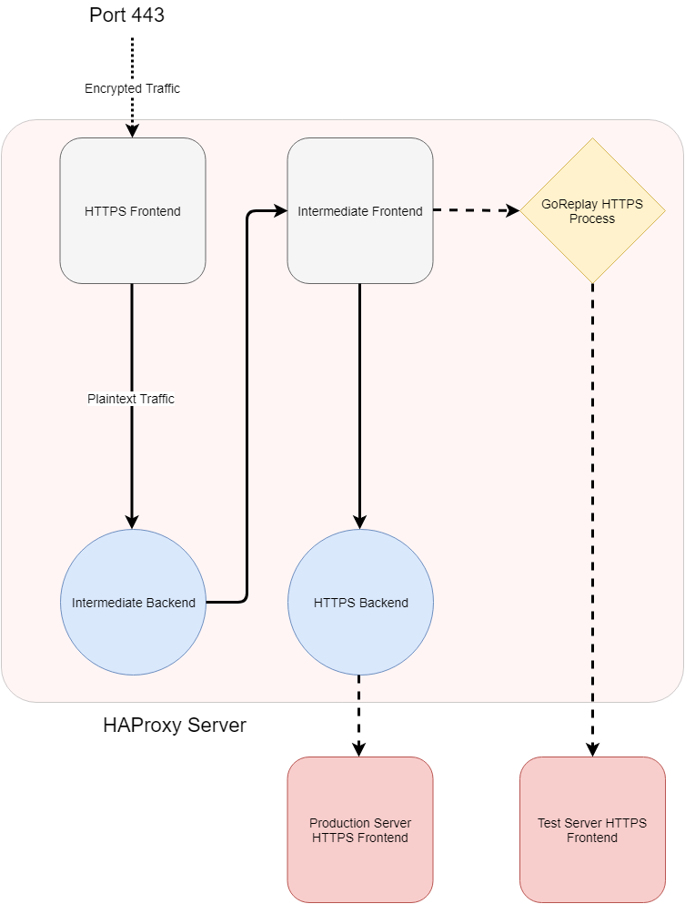
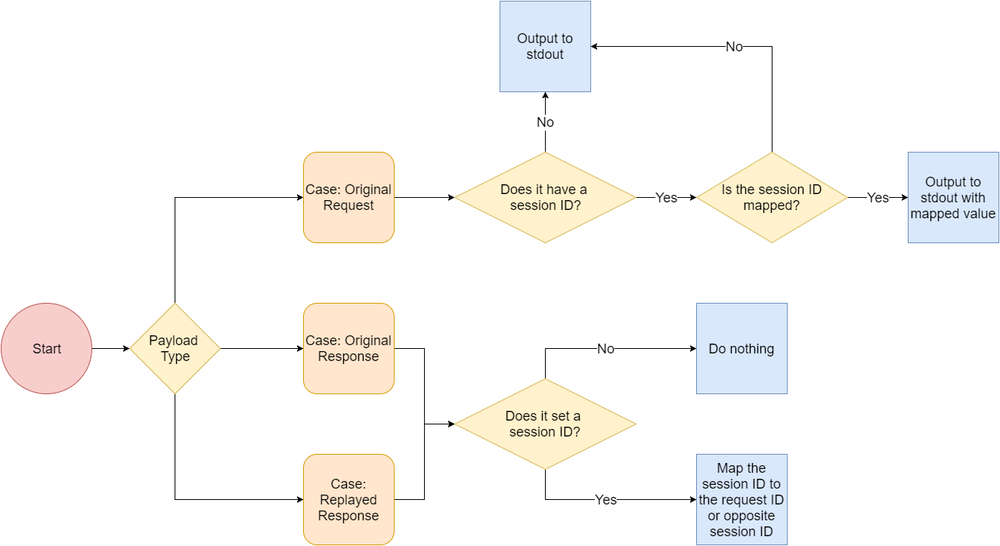

My team lead, Adam, [wrote a blog](https://medium.com/resdiary-product-team/resdiary-au-azure-migration-5c1bc13b201d) recently concerning how we migrated our AU servers from RackSpace to Azure. In that post (underneath him calling me out), he mentioned how important it was for us to gauge how our new infrastructure would compare to the current infrastructure. This post will describe our experience using [GoReplay](https://goreplay.org/) - a load testing tool that can replicate real traffic which we adopted as our primary tool for these load tests.

The ultimate goal of our load testing was to migrate to a set of infrastructure (loadbalancers, virtual machines, database, and caches) which could handle our expected traffic. It's always better to be cautious, adding slightly more capacity than you'll ever expect to need - despite this incurring additional expenses. More often than not, you'll deliberately over provision your infrastructure and plan to scale down in the future. However, if you have confidence in your test data you can avoid the hassle of this by getting it right the first time. The accuracy of your test data will depend on the strategy and tools that you decide to use.

Scripted tests can typically provide as high a throughput as you desire, allowing you to stress test your infrastructure with many requests. However, the diversity of these requests relies upon well designed tests that cover different branches of the application. Otherwise, you could end up repeating a request that isn't very resource intensive. You would need to consider how these repeated requests are handled by your database and/or cache too. This is unlikely to be representative of real traffic if your application is complex with many branches to cover.

You likely won't ever be fully confident that your manual or scripted load tests are _really_ as good as real traffic. If we were to test with live traffic, we would know that our tests throughput and request diversity were exactly* as they would really be for that period. GoReplay allows us to capture and replay traffic that was intended for our production infrastructure to our testing infrastructure. You can even modify your throughput with GoReplay by capturing live requests to a file, then replaying them later at a modified speed, or rate limit the replayed traffic (unfortunately this wasn't applicable for us as our application is time sensitive).

\*As mentioned by Adam in his post, it's imperative to ensure that your test servers won't produce damaging side effects as a result of them receiving live traffic. Our application ties in with many external services, payment providers for example, that could have disastrous side effects if triggered erroneously. Unfortunately, protecting against these side effects is likely to have any requests that call them fail faster. This can skew your test results, as these requests will seem less resource intensive than they would be in the live server.

## Installing and running GoReplay
We installed GoReplay on a VM running a HAProxy load balancer in order to intercept and replay the traffic. As we were using a Linux load balancer we never tried [the Windows flavour](https://github.com/buger/goreplay/wiki/Running-on-Windows) of GoReplay, which doesn't appear to support all the functionality of the Linux version. 

Installing GoReplay simply involves grabbing the latest binary from the [releases page on GitHub](https://github.com/buger/goreplay/releases):
```shell
$ wget https://github.com/buger/goreplay/releases/download/v0.16.1/gor_0.16.1_x64.tar.gz
$ tar -xzf gor_0.16.1_x64.tar.gz
$ ./goreplay -h
```

GoReplay works by listening for traffic from one or more inputs and forwarding them to one or more outputs. Typically we'll be using a single port as our input and an HTTP address for output, which looks a bit like this:



We can use this command to achieve this:
```shell
sudo nohup ./goreplay --input-raw :80 --output-http http://test.server < /dev/null > http.gor.log 2>&1 &
```
Where:
- `sudo` runs as root, which is necessary to listen to the network traffic [(unless you configure it otherwise)](https://github.com/buger/goreplay/wiki/Running-as-non-root-user). 
- `nohup` allows the command to ignore the _hangup signal_, which is triggered when you log out of the machine. We found this useful for long load tests.
- `--input-raw` listens to the port specified (`80`).
- `--output-http` replays traffic from any inputs to the given address (`http://test.server`).
- `< /dev/null` has the GoReplay process listen for input from `/dev/null` which never gives input but keeps the process open. Otherwise, the GoReplay process will expect input from `stdin` which won't be open while the process is in the background.
- `> http.gor.log` redirects any output from the process to a log file called `http.gor.log` so that we can refer to it if we need to, either during or after the load test. If your log files are too large, and you're confident enough with your setup, you may choose to redirect to `/dev/null` instead.
- `2>&1` redirects the `stderr` output to `stdout`, allowing us to collect error output in the same log file as specified above.
- `&` runs the process in the background. So that we can continue to use the shell while we run GoReplay.

We also wanted to replicate HTTPS traffic, but this proved to be a bit more problematic. [GoReplay can't simply replay encrypted requests](https://github.com/buger/goreplay/issues/529), so we had to modify our HAProxy config with this in mind:



By decrypting the traffic in the SSL frontend, then outputting the decrypted traffic to an intermediate port, we can configure GoReplay to listen to the intermediate port and replay the traffic to the test servers. The intermediate frontend then routes the traffic to the SSL backend as the SSL frontend did before. So we've effectively looped the traffic back into HAProxy to allow GoReplay to listen unencrypted traffic.

Here's an example of this in a HAProxy config file:
```
frontend ssl
    # Listen to port 443 and decrypt traffic
    bind *:443 ssl crt /etc/haproxy/certs.d/cert.pem no-sslv3
    mode http
    
    # ...
    # Output to man-in-the-middle backend
    default_backend ssl_termination_backend

backend ssl_termination_backend
    mode http

    # Output to port 2802, which ssl_termination_frontend listens to
    server ssl_termination_server localhost:2802

frontend ssl_termination_frontend
    # Listen to port 2802
    bind :2802
    mode http
    
    # Output to https backend
    default_backend ssl_backend

backend ssl_backend
    mode http
    balance
    
    http-request set-header Host server.com
    # ...
    # Output to server.com, log as http_server
    server https_server server.com:443 ssl ca-file /etc/haproxy/certs.d/cert.pem sni req.hdr(host)
```
Once we've setup our HAProxy config this way, we can listen to the intermediate port:
```shell
sudo nohup ./goreplay --input-raw :2802 --output-http https://test.server < /dev/null > https.gor.log 2>&1 &
```
The only differences we've made to the HTTP command are:
- We're now listening to a different port (our intermediate port - `2802`)
- We're outputting to `https://`
- We're logging to a different file

## GoReplay Middleware
Initially, we performed a dry run of our load testing process for a short period of time during off-peak hours. This uncovered an issue with replaying live requests containing [ASPX session cookies](https://msdn.microsoft.com/en-us/library/ms178581.aspx) to the test servers. For some requests made to the live server, the application will return a [`Set-Cookie` header](https://developer.mozilla.org/en-US/docs/Web/HTTP/Headers/Set-Cookie), which instructs the users browser to assign a cookie value pair. So, if we replicate the same HTTP request between the live and test servers where they both hold distinct session IDs, we will encounter `401` response codes. _Enter GoReplay middleware_. 

[Middleware](https://github.com/buger/goreplay/wiki/Middleware) allows you to modify the requests that you replay to your test servers based on the original request, original response and/or replayed response. By designing your own middleware, you can have GoReplay more effectively fulfil your needs. Middleware can take the form of any executable which reads input from `stdin` and outputs requests intended for replay to `stdout`. [A NodeJS framework](https://github.com/buger/goreplay/tree/master/middleware) is also available (which likely would have been easier to plug into than writing primitive Go code). 

In this case, we can map session IDs from the live server to those from the test server, then modify replayed requests with the mapped ID. We used [this handy example](https://github.com/buger/goreplay/blob/master/examples/middleware/token_modifier.go) from the GoReplay repository to build upon.

The basic algorithm involved looks like this:


Since middleware has no guarantee that any payload type (request, original response, replayed response) will arrive in any specific order, we map original session IDs to replayed sessions IDs in two maps. The mapping function is structured like this:
```go
// sessionID   - ASPX sessionID returned in this payload
// reqID       - Identifies membership of the same request triple, so
//               so any original response or replayed response responding 
//               to the same request will have the same reqID
// payloadType - One of {request, originalResponse, replayedResponse}, 
//               though requests shouldn't reach this function.
func sessionIDMapping(sessionID, reqID string, payloadType byte) {
	// If this request has already logged an opposite session ID
	if otherSessionID, ok := asyncRequestIDQueue[reqID]; ok {
		switch payloadType { // map original -> replayed
		case payloadOriginalResponse: // if it's the original response
			Debug(fmt.Sprintf("Mapping %s to %s", sessionID, otherSessionID))
			sessionIDToReplaySessionID[sessionID] = otherSessionID
		case payloadReplayedResponse: // if it's the replayed response
			Debug(fmt.Sprintf("Mapping %s to %s", otherSessionID, sessionID))
			sessionIDToReplaySessionID[otherSessionID] = sessionID
		}
		delete(asyncRequestIDQueue, reqID) // delete entry from the async map for clarity
	} else { // if this request ID hasn't been logged
		Debug(fmt.Sprintf("Mapping request ID %s to %s", reqID, sessionID))
		asyncRequestIDQueue[reqID] = sessionID
	}
}
```
This function asynchronously handles responses or replayed responses setting session ID cookies. Since GoReplay has each triple (request, response, replayed response) share a request ID, the first response to reach the middleware can map its session ID to the request ID. When the second response arrives we then have access to both session IDs and we can map the original to the replayed session ID with the knowledge of which one is which (since the second response type is also available).

Using GoReplay, we were able to accurately estimate our infrastructure requirements and highlight the flaws in our prospective setup. When the time came to flip the switch, we had confidence that we wouldn't encounter any major catastrophes as we had caught them in our load tests. We're in the process of performing similar load tests using GoReplay to aid in our UK migration to Azure (an even greater task than the AU migration). We're confident enough to run GoReplay totally unsupervised for days on end now. A longer test period is now necessary as our recovery time between tests is ~24 hours due to the gargantuan database.
